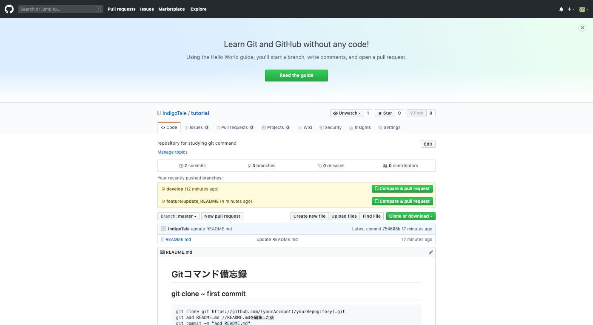
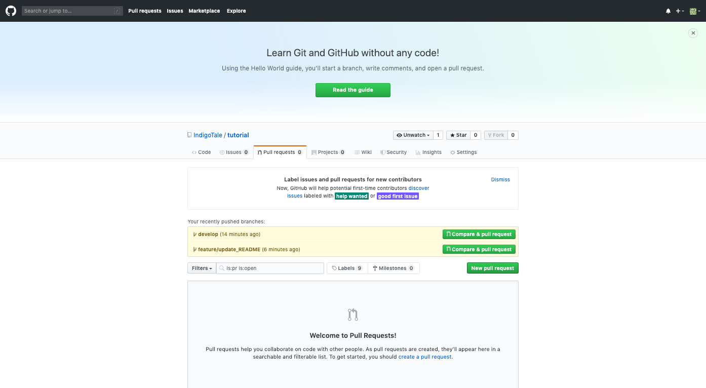
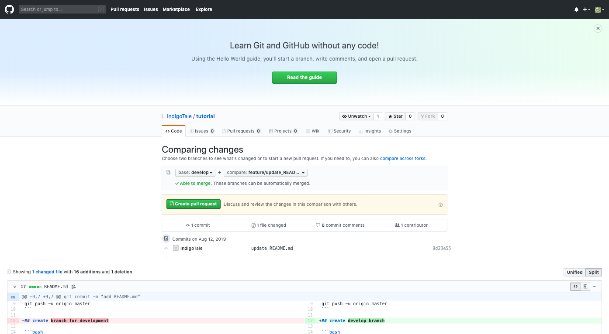
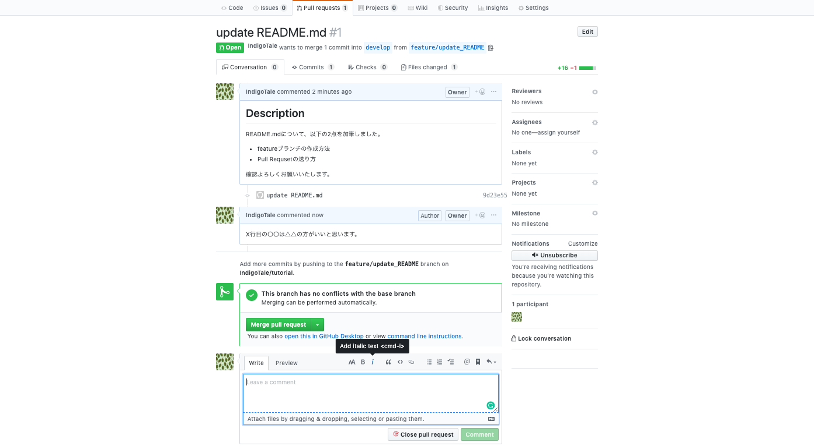

# Gitコマンド備忘録

## git clone ~ first commit

```bash
git clone git https://github.com/(yourAccount)/yourRepogitory).git
git add README.md //README.mdを編集した後
git commit -m "add README.md"
git push -u origin master
```

## create develop branch

```bash
> git branch
* master
> git branch develop master
> git branch
  develop
* master
> git checkout develop
Switched to branch 'develop'
> git branch
* develop
  master
> mkdir src && touch hello.py
> git add src/hello.py
> git commit -m "add src/hello.py"
> git push origin develop
```

## create feature branch

```bash
> git branch feature/update_README develop
> git checkout feature/update_README
// Edit README.md
> git add README.md
> git commit -m "update README.md"
> git push origin feature/update_README
```

## Pull Request

ブラウザを利用したPull Requestの送り方が簡単なのでそちらを説明
1. githubの対象リポジトリを開き，Pull Requests をクリック

2. New Pull Request をクリックして新規作成

3. baseとcompareを選択してcreate pull requestをクリック

4. 具体的な差分や追加する機能などについて説明文を書いてからcreate pull requestをクリック
5. 作成したpull requestの画面，他の開発者がコメントを書くことが可能．開発者同士で確認がとれたら，merge pull requestをクリックしてbaseをcompareで上書きする．
